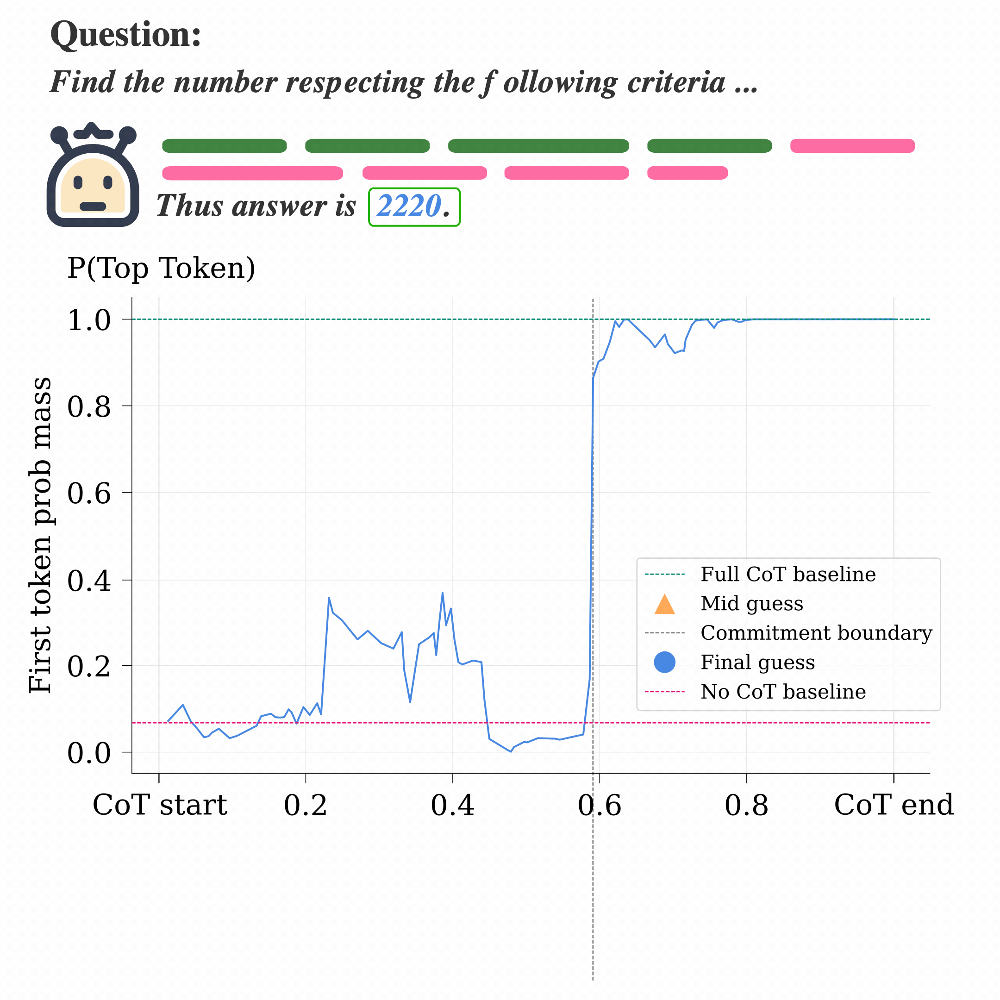

# Beyond the Commitment Boundary: Probing Epiphenomenal Chain-of-Thought in Large Reasoning Models

Official code for the paper
[**Beyond the Commitment Boundary: Probing Epiphenomenal Chain-of-Thought in Large Reasoning Models**](https://arxiv.org/abs/2606.13603).

[📜 Paper](https://arxiv.org/abs/2606.13603) ·
[⚙️ Practical pipeline](docs/PIPELINE.md) ·
[✍️ Citation](#citation)

<p align="center">
  
</p>

Large reasoning models often settle on their final answer well before their
chain of thought ends. We call this transition the **commitment boundary**.
This repository provides the code used to:

- locate the boundary through sentence-level causal truncation;
- distinguish `no_guess`, `mid_guess`, and `final_guess` reasoning stages;
- train causal attention probes to detect answer commitment from activations;
- early-exit reasoning once the final answer has stabilized; and
- stress-test pre- and post-boundary reasoning through numeric perturbations.

## Contents

- [Method at a glance](#method-at-a-glance)
- [Installation](#installation)
- [Quick start](#quick-start)
- [Running individual stages](#running-individual-stages)
- [Models and benchmarks](#models-and-benchmarks)
- [Repository structure](#repository-structure)
- [Outputs and data](#outputs-and-data)
- [Citation](#citation)

## Method at a glance

The experimental pipeline has four main stages:

1. **Generate traces.** Sample complete CoT traces while preserving the model’s
   native beginning- and end-of-thinking tokens.
2. **Measure answer formation.** Truncate each trace at every sentence boundary,
   force a direct answer, and track when the elicited answer becomes equivalent
   to the full-CoT answer.
3. **Train the probe.** Label sentence states as `no_guess`, `mid_guess`, or
   `final_guess`, then train a lightweight causal attention probe on model
   activations.
4. **Early exit.** Stop the CoT after consecutive `final_guess` predictions and
   compare the resulting accuracy–token-savings trade-off with fixed truncation.

The full practical description -- including filtering, answer verification,
activation extraction, probe training, and perturbation experiments -- is in
[docs/PIPELINE.md](docs/PIPELINE.md).

## Installation

Python 3.11 or newer is required. The pipeline uses separate environments for
vLLM inference and NNsight activation collection because their GPU dependency
requirements may differ.

```bash
# NNsight and probe environment
python3 -m venv .venv
source .venv/bin/activate
pip install -e .

# vLLM trace-generation and attribution environment
python3 -m venv .venv-vllm
source .venv-vllm/bin/activate
pip install -e ".[vllm]"
```

Model downloads may require a Hugging Face access token:

```bash
export HF_TOKEN=...
```

## Quick start

The pipeline driver defaults to `openai/gpt-oss-20b`, trains the probe on
MATH-500, and evaluates it on the four paper benchmarks:

```bash
VLLM_PYTHON=.venv-vllm/bin/python \
PROBE_PYTHON=.venv/bin/python \
MODEL=openai/gpt-oss-20b \
PROBE_LAYER=23 \
./scripts/run_pipeline.sh
```

Run only selected stages:

```bash
STAGES=traces,attribution ./scripts/run_pipeline.sh
STAGES=probe,early_exit ./scripts/run_pipeline.sh
```

For a small smoke run:

```bash
DATASETS="MATH-500,opencompass/AIME2025" \
TRACE_COUNT=4 \
MAX_QUESTIONS=10 \
./scripts/run_pipeline.sh
```

The default generation settings match the paper: temperature `0.7`, top-p
`0.9`, and at most `16,384` new tokens. The experiments use 16 traces per
question for GPT-OSS and 8 for the other model families.

## Running individual stages

### 1. Generate reasoning traces

```bash
.venv-vllm/bin/python scripts/generate_traces.py \
  --model_name openai/gpt-oss-20b \
  --data_name MATH-500 \
  --num_out 16 \
  --no_cot False
```

### 2. Compute sentence-level causal labels

```bash
.venv-vllm/bin/python -m attributions.vllm_sentence_causal \
  --model openai/gpt-oss-20b \
  --data_name MATH-500 \
  --semantic_guess_labels True \
  --clue_alpha 0.5
```

### 3. Train the three-way commitment probe

```bash
.venv/bin/python -m attributions.train_solution_probe \
  --model openai/gpt-oss-20b \
  --data_name MATH-500 \
  --layer 23 \
  --task_mode three_way \
  --sentence_aggregation last \
  --max_probe_input_tokens 256
```

### 4. Evaluate probe-guided early exit

```bash
.venv/bin/python -m attributions.solution_probe_early_exit_exps \
  --model openai/gpt-oss-20b \
  --data_name MATH-500 \
  --probe_dir outputs/gpt-oss-20b/MATH-500/contribution_graphs/sentence_causal/boxed/solution_probe_three_way_last \
  --probe_layer 23 \
  --eval_question_subset eval \
  --exit_ks 1,2,5,10 \
  --fixed_exit_percentages 50,70,80,90,95
```

## Models and benchmarks

The paper evaluates three model families across four reasoning benchmarks.

| Model | Layers included in the probe sweep |
|---|---:|
| `openai/gpt-oss-20b` | 12, 19, 22, 23 |
| `google/gemma-4-26B-A4B-it` | 15, 23, 27, 29 |
| `Qwen/Qwen3-14B` | 19, 31, 35, 39 |

| Benchmark | Task type |
|---|---|
| MATH-500 | Competition mathematics |
| AIME 2025 | Challenging competition mathematics |
| ZebraLogic | Multi-step logical reasoning |
| GPQA-Diamond | Graduate-level multiple-choice science |

## Repository structure

```text
attributions/
  vllm_sentence_causal.py         Prefix attribution and answer-stage labels
  train_solution_probe.py         Three-way causal attention probe
  solution_probe_early_exit_exps.py
                                  Full, fixed, and probe exit evaluation
  vllm_cot_number_perturbation.py Pre/post-boundary perturbation experiment
  activation_cache.py             NNsight activation extraction and caching
  modeling.py                     Supported model-family accessors
  shared/                         Sentence splitting and shared utilities
scripts/
  generate_traces.py              vLLM trace generation
  run_pipeline.sh                 End-to-end portable pipeline
docs/
  PIPELINE.md                     Practical explanation of the paper workflow
```

## Outputs and data

This repository intentionally tracks only code, documentation, and the teaser
asset. Generated artifacts are written locally to:

```text
data/       sampled reasoning traces
outputs/    attributions, activation caches, probe weights, and evaluations
```

Both directories are ignored by Git.

## Citation

If you use this code, please cite the
[paper](https://arxiv.org/abs/2606.13603). Citation metadata is also available
in [CITATION.cff](CITATION.cff).

```bibtex
@article{scalena2026commitment,
  title   = {Beyond the Commitment Boundary: Probing Epiphenomenal
             Chain-of-Thought in Large Reasoning Models},
  author  = {Scalena, Daniel and Candussio, Sara and Bortolussi, Luca and
             Fersini, Elisabetta and Nissim, Malvina and Sarti, Gabriele},
  journal = {arXiv preprint arXiv:2606.13603},
  year    = {2026}
}
```
